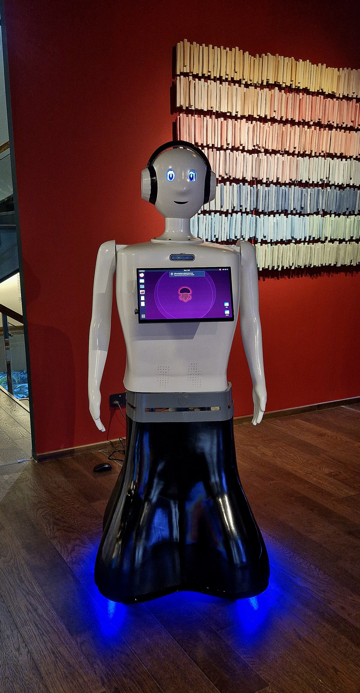
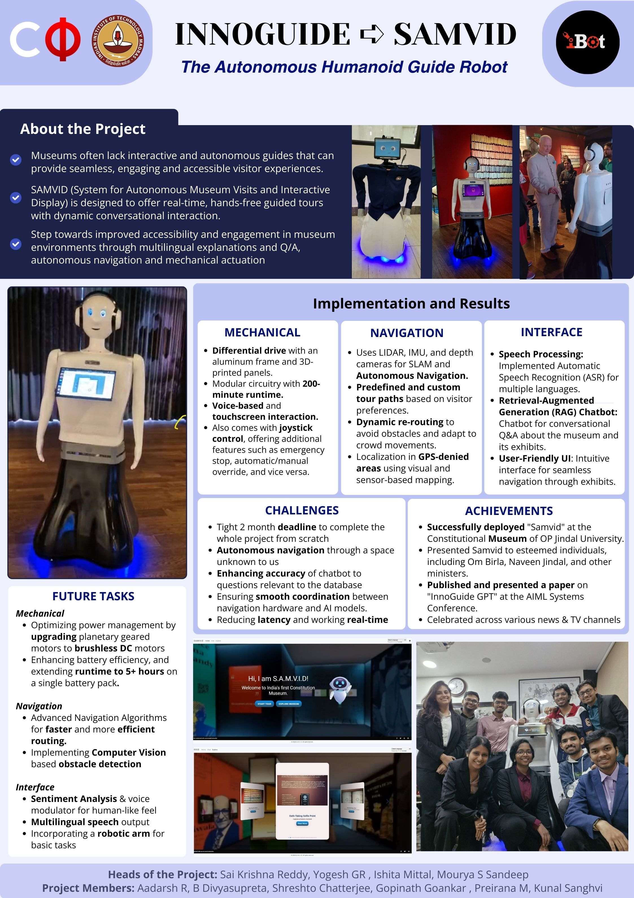

# S.A.M.V.I.D - The Autonomous Humanoid Guide Robot

**S.A.M.V.I.D (System for Autonomous Museum Visits and Interactive Displays)** is an autonomous humanoid guide robot developed to redefine the visitor experience in museums. It offers dynamic, hands-free guided tours with multilingual conversational interaction, Q&A, and intelligent navigation.

The robot was built specifically for **India’s First Constitutional Museum** at Sonipat, Haryana, in collaboration with **Jindal Global University**, and was inaugurated and deployed on the occasion of the **75th Constitutional Day**.

Developed in a tight two-month timeline at the **Centre for Innovation (CFI), IIT Madras**, this project represents a significant milestone in student-led innovation in robotics and AI.

---

## Table of Contents

- [Core Features](#-core-features)
- [Tech Stack](#️-tech-stack)
- [Key Achievements & Recognition](#-key-achievements--recognition)
- [Deployments](#-deployments)
- [Future Work](#-future-work)
- [The Team](#-the-team)
- [Gallery](#️-gallery)
- [Contact & License](#-contact--license)

---

## Core Features

### Mechanical & System Design
- **Robust & Modular Build:** Features a differential drive system built on a durable aluminum frame with 3D-printed parts for rapid prototyping.
- **High-Performance Compute:** Powered by an onboard **NVIDIA Jetson Orin** for real-time AI inference and sensor fusion.
- **Extended Runtime:** Optimized modular circuitry provides a **200+ minute operational runtime** on a single charge.

### Autonomous Navigation & SLAM
- **GPS-Denied Environment Navigation:** Utilizes a sensor suite including **LiDAR, IMU, and Depth Cameras** for robust localization and mapping (SLAM) in indoor spaces like museums.
- **Dynamic Path Planning:** Creates pre-defined or custom tour paths and dynamically re-routes to avoid static and dynamic obstacles, ensuring safe and seamless movement.
- **Sensor Fusion:** Built on **ROS 2**, integrating multiple sensors and microcontrollers for real-time data processing and decision-making.

### Interactive User Experience
- **Multilingual Conversational AI:** Implements Automatic Speech Recognition (ASR) for multiple languages, allowing visitors to interact naturally.
- **Retrieval-Augmented Generation (RAG) Chatbot:** A sophisticated Q&A system provides visitors with in-depth, context-aware information about the museum and its exhibits.
- **Intuitive Touchscreen Interface:** A user-friendly UI allows for easy tour selection and seamless navigation through different exhibits.
- **Dual Control Modes:** Supports both fully autonomous operation and a manual joystick override for testing and safety.

---

## Tech Stack

| Category              | Technologies & Components                                     |
| --------------------- | ------------------------------------------------------------- |
| **Core Framework** | `ROS 2 Humble`                                                |
| **Hardware** | NVIDIA Jetson, ESP32, Arduino Mega, Cytron Motor Drivers      |
| **Sensors** | LiDAR, Intel RealSense Depth Cameras, IMU                     |
| **AI / Interaction** | Wakeword Detection, Multilingual ASR, RAG for Conversational Q&A      |
| **User Interface** | Interactive Touchscreen (Custom Web UI), ReSpeaker Mic Array          |

---

## Key Achievements & Recognition

- **Successful Deployment:** Fully deployed at the **Constitutional Museum of OP Jindal University**, where it successfully guided esteemed individuals and visitors.
- **Published Research:** A paper on the project, titled **"InnoGuide-GPT,"** was published and presented at the **AIMLSystems Conference**.
- **Media Coverage:** Celebrated and featured across various national news and TV channels. 
- **Best Hardware Project Award (2024–25):** at the Centre for Innovation, IIT Madras.

### Media Links
- [Article on the Project](https://www.thehindu.com/news/national/tamil-nadu/iit-m-students-develop-robot-for-op-jindal-universitys-constitution-museum/article68863807.ece)
- [YouTube Video](https://youtu.be/DQfoyurXsFA?si=shBC_hgf3OSulV6E)
- [IITM LinkedIn Video]([https://linkedin.com/example-video](https://www.linkedin.com/feed/update/urn:li:activity:7310137447776952320/))
- [IITM Post](https://linkedin.com/example-post](https://x.com/iitmadras/status/1859572619634466844))

---

## Deployments

1.  **Constitutional Museum, Sonipat, Haryana:** Deployed as "Samvid," providing guided tours and interactive explanations to visitors.
2.  **Centre for Innovation (CFI), IIT Madras:** Branded as "InnoGuide," it autonomously guides visitors through the various project spaces at CFI.

---

## Future Work

Our roadmap includes several key enhancements to expand the robot's capabilities:

- **Mechanical Upgrades:**
    - Upgrading to brushless DC motors for better performance and efficiency.
    - Enhancing battery systems to achieve **5+ hours of runtime**.
    - Incorporating a **robotic arm** for basic object interaction tasks.
- **Advanced Navigation:**
    - Implementing advanced navigation algorithms for faster and more efficient routing.
    - Integrating computer vision-based obstacle detection for improved safety.
- **Smarter Interface:**
    - Adding **sentiment analysis** to gauge visitor mood and adapt the interaction style.
    - Expanding multilingual speech output capabilities.

---

## The Team

This project was brought to life by a dedicated team of 11 students from the **iBot (Robotics) Club, CFI, IIT Madras**, in collaboration with designers from **Jindal Global University**.

- **Heads of the Project:**
  - Sai Krishna Reddy (Co-Project Lead)  
  - Mourya S Sandeep (Co-Project Lead & Mechatronics & Design Module Lead)  
  - Yogesh GR (Navigation & Design Module Lead & Strategist)  
  - Ishita Mittal (Interface Module Lead)  

- **Project Members:**  
  - Aadarsh R  
  - B Dvyasuprreta  
  - Shreshto Chatterjee  
  - Gopinath Goankar  
  - Preirana M  
  - Kunal Sanghvvi  

---

## Gallery

  

---

## Contact & License

This project was developed as part of student-led innovation at the Centre for Innovation, IIT Madras. The source code and design files are not publicly available at this time.

For collaborations, demonstrations, or other inquiries, please contact the project team or the CFI, IIT Madras.

---
Copyright © 2025 - Team S.A.M.V.I.D, Centre for Innovation. All Rights Reserved.
